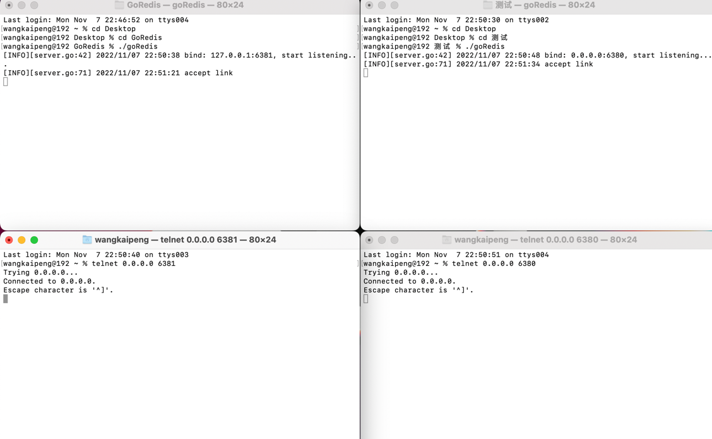
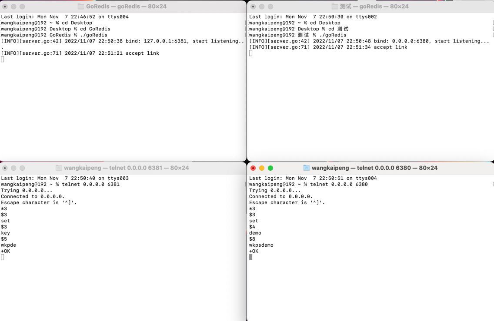
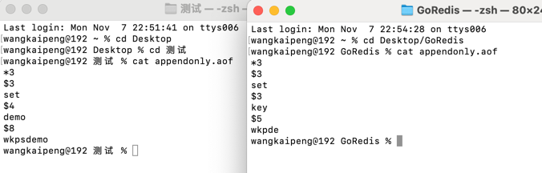
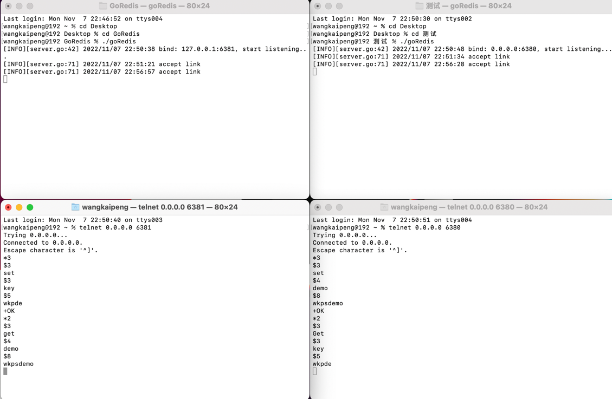

# GoRedis(该项目为本人2023年河南工业大学本科毕业课设)

### 项目简介

* 使用go语言实现Redis的基础命令，比如set，get和AOF等基础功能。

### 使用方法

* 单机启动

  * 直接启动程序即可。

* 集群启动

  * 通过`go build`命令生成可执行文件。

  * 把可执行文件单独放到一个文件夹，注：文件夹中需要包含配置(redis.conf)。

  * port不可重复，self为自己的ip+端口号，peers为集群中另外的ip+端口号。

  * ```
    bind 0.0.0.0
    port 6379
    
    appendonly yes
    appendfilename appendonly.aof
    
    self 127.0.0.1:6379
    peers 127.0.0.1:6380
    ```

  * 之后macOS或者linux进入相对应的文件夹执行`./goRedis`即可运行

  * 运行之后可以看到`[INFO][server.go:42] 2022/10/09 10:36:47 bind: 0.0.0.0:6380, start listening...`。

  * 通过网络调试助手连接TCP客户端`[INFO][server.go:71] 2022/10/09 10:37:30 accept link`。

  * 即可正常发送命令。
### 日志
* 日志信息信息主要记录项目启动时间。
* 是否有连接，连接时间等。

### AOF

* 主要通过项目下的appendonly.aof记录操作信息。
* 再重启系统时进行LoadAof防止重启机器信息丢失。

### 注：简易先看一下Resp协议，方便后期发送请求
>*3/r/n$3/r/nset/r/n$4/r/nname/r/n$5/r/npdudo/r/n


### 注释：mac
> 因为我本身使用的是macOS，在使用RESP的时候没办法直接用网络调试助手发送tcp，只能采用telnet命令。
> 注意重点就是需要先下载Homebrew，才能在mac的终端上执行命令。


## 成果展示
* 启动
  * 
* set测试
  * 
* AOF效果
  * 
* Get测试
  * 

--------------------------------------------
# 毕设准备
### 为什么选择本课题
* 因为看到Http3弃用TCP作为传输层协议通信方式，于是我想用自己的方式记录一下TCP。
* 对于后端软件开发来说，Redis是一个仅次于数据库的至关重要的部分。并且可以弥补多次请求数据库带来的IO请求的时间浪费。

### Redis为什么快
* 因为在计算机组成原理中，我们可以了解到，访问时间的快慢排序为：寄存器<L1,L2,L3缓存<内存<固态硬盘<机械硬盘。在Redis中，存储在内存中，然后持久化是存储在硬盘上，所以速度也会比传统数据库要更快。
* Redis的多路复用“复用”指的是复用同一个线程。采用多路 I/O 复用技术可以让单个线程高效的处理多个连接请求（尽量减少网络 IO 的时间消耗），且 Redis 在内存中操作数据的速度非常快，也就是说内存内的操作不会成为影响Redis性能的瓶颈，主要由以上几点造就了 Redis 具有很高的吞吐量。
* 完全基于内存，绝大部分请求是纯粹的内存操作，非常快速。数据存在内存中，类似于HashMap，HashMap的优势就是查找和操作的时间复杂度都是O(1)；

### 和传统数据库的区别
* Redis是非关系型数据库，是基于键值对的对应关系，用于超大规模数据的存储。
* nosql数据库将数据存储于缓存之中，关系型数据库将数据存储在硬盘中，自然查询速度远不及nosql数据库。
*  性能NOSQL是基于键值对的，可以想象成表中的主键和值的对应关系，而且不需要经过SQL层的解析，所以性能非常高。

# 设计细节
### 简易TCP服务器
* TCP相关配置参考`config.config`和`redis.conf`配置文件
* 项目中源码

```go
func (h *EchoHandler) Handle(ctx context.Context, conn net.Conn) {
	if h.closing.Get() {
		// closing handler refuse new connection
		_ = conn.Close()
	}

	client := &EchoClient{
		Conn: conn,
	}
	h.activeConn.Store(client, struct{}{})

	reader := bufio.NewReader(conn)
	for {
		// may occurs: client EOF, client timeout, handler early close
		msg, err := reader.ReadString('\n')
		if err != nil {
			if err == io.EOF {
				logger.Info("connection close")
				h.activeConn.Delete(client)
			} else {
				logger.Warn(err)
			}
			return
		}
		client.Waiting.Add(1)
		b := []byte(msg)
		_, _ = conn.Write(b)
		client.Waiting.Done()
	}
}
```
>其中Context包主要用来传递超时时间，目前环境，参数等，Conn主要用来处理

```go
type Config struct {
	Address    string        `yaml:"address"`
	MaxConnect uint32        `yaml:"max-connect"`
	Timeout    time.Duration `yaml:"timeout"`
}
```
>在tcp包下的server层定义结构体，用来设定一些链接细节。

```go
func ListenAndServeWithSignal(cfg *Config, handler tcp.Handler) error {
	closeChan := make(chan struct{})
	sigCh := make(chan os.Signal)
	signal.Notify(sigCh, syscall.SIGHUP, syscall.SIGQUIT, syscall.SIGTERM, syscall.SIGINT)
	go func() {
		sig := <-sigCh
		switch sig {
		case syscall.SIGHUP, syscall.SIGQUIT, syscall.SIGTERM, syscall.SIGINT:
			closeChan <- struct{}{}
		}
	}()
	listener, err := net.Listen("tcp", cfg.Address)
	if err != nil {
		return err
	}
	logger.Info(fmt.Sprintf("bind: %s, start listening...", cfg.Address))
	ListenAndServe(listener, handler, closeChan)
	return nil
}
```
> 用来监听连接，所以
```go
func ListenAndServe(listener net.Listener, handler tcp.Handler, closeChan <-chan struct{}) {
	// listen signal
	go func() {
		<-closeChan
		logger.Info("shutting down...")
		_ = listener.Close() // listener.Accept() will return err immediately
		_ = handler.Close()  // close connections
	}()

	// listen port
	defer func() {
		// close during unexpected error
		_ = listener.Close()
		_ = handler.Close()
	}()
	ctx := context.Background()
	var waitDone sync.WaitGroup
	for {
		conn, err := listener.Accept()
		if err != nil {
			break
		}
		// handle
		logger.Info("accept link")
		waitDone.Add(1)
		go func() {
			defer func() {
				waitDone.Done()
			}()
			handler.Handle(ctx, conn)
		}()
	}
	waitDone.Wait()
}
```
> 一直死循环，除非连接出问题。这样实现一直在等待链接。

# RESP协议
* 什么是RESP协议
>RESP 是 Redis 序列化协议的简写。它是⼀种直观的⽂本协议，优势在于实现异常简单，解析性能极好。
Redis 协议将传输的结构数据分为 5 种最⼩单元类型，单元结束时统⼀加上回⻋换⾏符号\r\n。
* 细节如下：
  * 1. 单⾏字符串 以 + 符号开头。
  * 2. 多⾏字符串 以 $ 符号开头，后跟字符串⻓度。
  * 3. 整数值 以 : 符号开头，后跟整数的字符串形式。
  * 4. 错误消息 以 - 符号开头。
  * 5. 数组 以 * 号开头，后跟数组的⻓度。
* 示例：
  * >单⾏字符串 hello world
    +hello world\r\n
  * >多⾏字符串 hello world
    $11\r\nhello world\r\n
    > 
  * >整数 1024
    :1024\r\n
    > 
# go语言实现RESP协议解析
* 详细参考resp目录下的代码实现，这里只展示核心
  * ```go
    type Connection struct {
        conn net.Conn
        // waiting until reply finished
        waitingReply wait.Wait
        // lock while handler sending response
        mu sync.Mutex
        // selected db
        selectedDB int
    }
  * 细节参考resp.parser.parser.go

# 为什么选择go语言
### go语言的特点
* 性能
* 轻量级
* 开发者效率(特别是web开发)
* 并发性较好(Goroutines)
* 快速的编译时间
* 强大的生态系统
### go和java的区别

* Go语言拥有简明的类型系统、函数式编程范式和先进的并发编程模型。因此其代码块更小更简洁、可重用性更高，并可在多核计算环境下更快地运行。
* Java是一种静态面向对象编程语言，继承了很多的C++优点，功能强大、简单易用、跨平台可移植，具有多线程、分布式等特点。入门学习不难，随着项目经验的积累逐步提升进阶。
# @Author:Wangkaipeng
